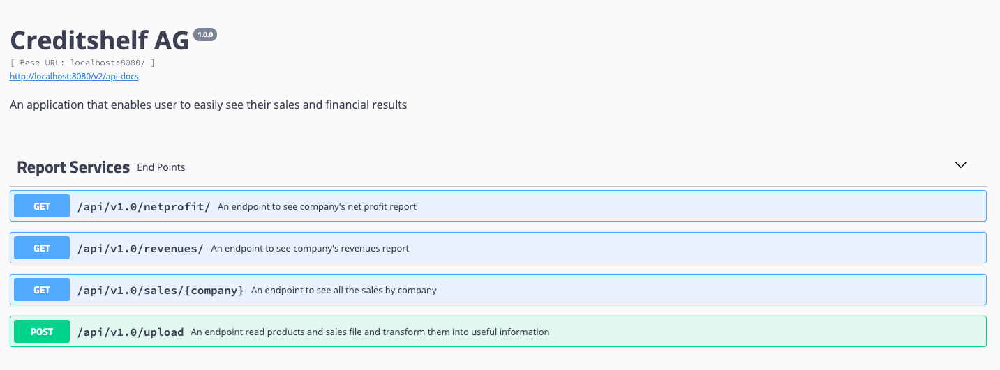

# creditshelf-report-app
Application that enables users to easily see their sales and financial results, to read the products description file and sales file and transform them into useful informations.

# Stack Used
Java 8  
Spring Boot  
Maven  
Docker

# Setup

Ensure docker installed in your machine 
Pull this repository and goto the application folder 
Run **docker-compose up** and wait untill application get started 
Goto **http://localhost:8080/swagger-ui.html** and get served by various endpoints. 

Sample:

